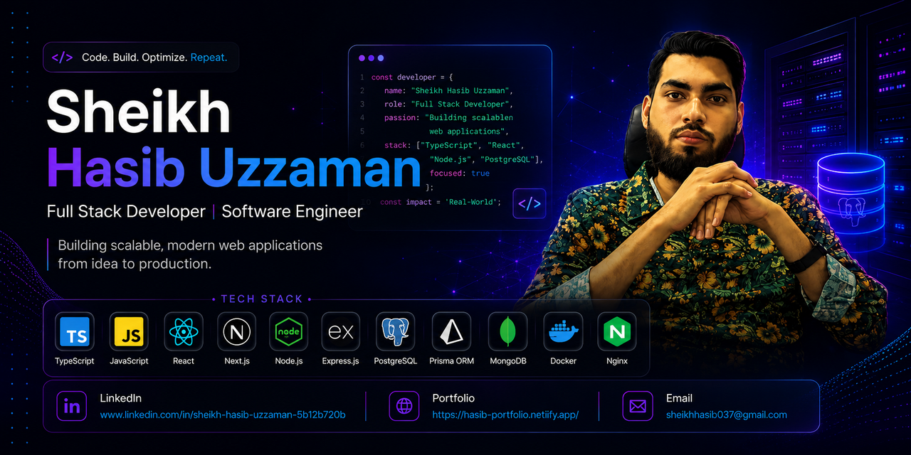

<!--- banner --->

<!--- title --->
<h1>Hi 👋, I'm Sheikh Hasib Uzzaman</h1>

### 🔭 I build things with JavaScript, TypeScript, React, and Node.js

---

## 👨‍💻 About Me

I'm a Full Stack Developer based in Jessore, Bangladesh, with hands-on experience building responsive, real-world web applications using **React**, **Node.js**, **Express**, and **Firebase**. I previously worked as a Full Stack Developer at **UDDIPAN**, where I built and maintained full-stack apps with role-based Firebase authentication and RESTful APIs.

I'm currently advancing into **TypeScript**, **Next.js**, **PostgreSQL**, **Prisma ORM**, **Docker**, and AI-driven engineering through the **Next Level Web Dev — AI-Driven Software Engineering Bootcamp (Batch 07)** by Programming Hero, covering everything from database design and backend architecture to LangChain and RAG. Feel free to reach out if you want to talk about **web development**, backend systems, or AI-powered tools!

---

## 🛠️ Tech Stack

### **Languages**

### **Frontend**

### **Backend**

### **Database & ORM**

### **AI / ML**

### **DevOps & Cloud**

### **Tools & Others**

---

## 🚀 Featured Projects

### 🏍️ [Fiacre Terra — Motorcycle Marketplace](https://github.com/Sheikhasib)
A motorcycle marketplace with Firebase Authentication, protected routes, and a full CRUD API for products and orders.
**Stack:** React · Node.js · Express · MongoDB · Firebase Auth

### ✈️ [WorldTour — Travel & Tourism Platform](https://github.com/Sheikhasib)
A travel and booking platform with dynamic destination/package listings and secure booking management.
**Stack:** React · Node.js · Express · MongoDB · Firebase Auth

### 👶 [Infant Endeavor — Childcare Service Website](https://github.com/Sheikhasib)
A childcare service website with a complete authentication flow and a clean, parent-friendly UI.
**Stack:** React · Firebase · Bootstrap

> Replace the links above with your actual repo URLs.

---

## 🌐 Connect With Me

---

## 📊 GitHub Stats

|                                                    GitHub Stats                                                     |                                                    Most Used Languages                                                     |
| :-------------------------------------------------------------------------------------------------------------------: | :----------------------------------------------------------------------------------------------------------------------: |
|  |  |

---

